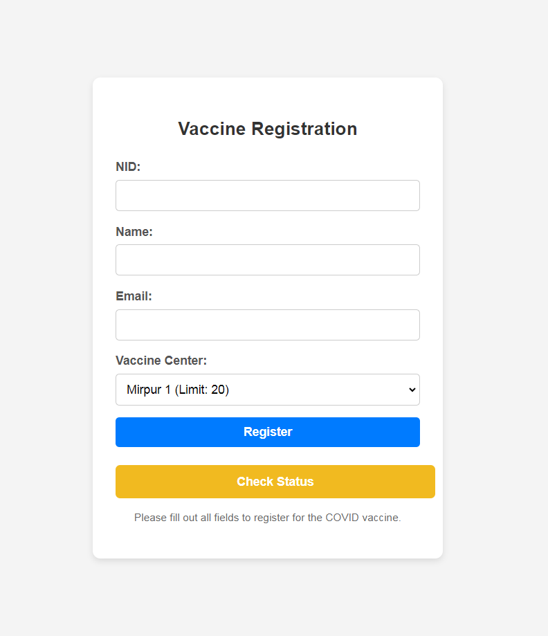

## Covid Vaccine System

-   [Clone the repository from here] (https://github.com/ApelSarkar/Covid-vaccine-system).

## Install Dependencies

-   `composer install`

## Set up the environment file:

-   `cp .env.example .env`
-   `php artisan key:generate`

## Run the migrations:

-   `php artisan migrate`

## Pre-populate the Database run db seed:

-   `php artisan db:seed`

## Run scheduler command to execute vaccination schedule:

-   `php artisan vaccination:schedule`

## Start the development server:

-   `php artisan serve`

## How I would optimise these:

If I have more time i opitimize the project in several ways like:

**Database indexing**: I ensure that the key columns, like nid (National ID), email, and vaccine_center_id, are indexed. This will help speed up database write and read operations.

**Batch Insertions**: If handling bulk registrations, use batch inserts to reduce the number of database transactions:

**Queue for Time-Consuming Tasks**: For processes like sending emails or other heavy operations during registration, I used Laravel queu.

**Full-Text Search**: I will implement full-text indexing for faster searches, especially for columns like name, email, or any other text-based fields:

**Eager Loading**: If my search queries often involve relationships (e.g., vaccine_center),I use eager loading to minimize the number of database queries.

**Cache Search Results**: For commonly searched terms or filters, I can use Laravel's cache to improve search result.

## Integrate an SMS Service:

I will Twilio or any local SMS gateway provider.
I had update the current email notification logic to also sending SMS.

As I used Scheduler, when I run a command with a specific time and date, the mail is sent to the user.

For SMS notication I can also use scheduler command like and changed the logic in ScheduleVaccination.php file

-   `php artisan send:notifications`

### Screenshot section:I've added screenshots below:

-   **Registration Form**:

  

-   **Vaccination Status Successfull**:

  

-   **Vaccination Status Form**:

  

-   **Vaccination Status Search result**:

  

-   **Vaccination Center limit status check result**:

  

-   **Vaccination Registration not found status check result**:

  

-   **Vaccination Registration mail check result**:

  

